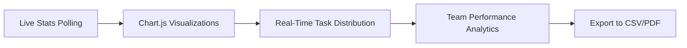
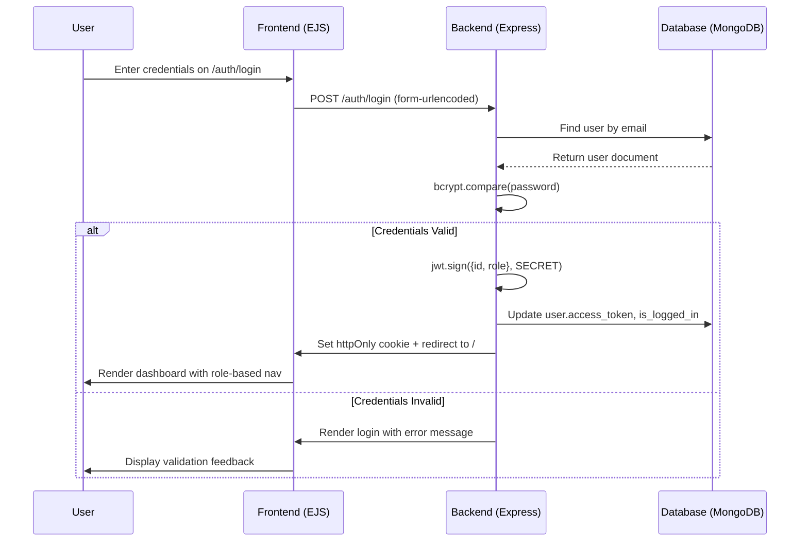

# 🚀 Task Management System — Enterprise-Grade Productivity Platform

> ### 🔗 **LIVE DEMO**: [https://task-management-system-qbnd.onrender.com/](https://task-management-system-qbnd.onrender.com/)
>
> _Click above to experience the full platform instantly — no installation required._

---

<div align="center">


**⭐ One of the Most Polished MERN-Style Task Platforms Built with Pure Express + EJS**

</div>

---

## 📑 Table of Contents

<details>
<summary><strong>👆 Click to Expand Navigation</strong></summary>

1. [✨ Dynamic Feature Showcase](#-dynamic-feature-showcase)
2. [🎯 Core Functionalities](#-core-functionalities)
3. [🏗️ Technical Architecture](#️-technical-architecture)
4. [🛠️ Technology Stack](#️-technology-stack)
5. [🔐 Authentication & Security](#-authentication--security)
6. [📁 Project Structure](#-project-structure)
7. [⚙️ Installation & Setup](#️-installation--setup)
8. [🌐 API Documentation](#-api-documentation)
9. [🎨 UI/UX Highlights](#-uiux-highlights)
10. [🚀 Deployment Guide](#-deployment-guide)
11. [🤝 Contributing](#-contributing)
12. [📜 License](#-license)
13. [📬 Contact & Support](#-contact--support)

</details>

---

## ✨ Dynamic Feature Showcase

> _Experience these features live at the demo link above — each interaction is engineered for fluidity and performance._

### 🔄 Real-Time Interface Dynamics

| Feature                      | Description                                                                                 | Visual Feedback                                                                   |
| ---------------------------- | ------------------------------------------------------------------------------------------- | --------------------------------------------------------------------------------- |
| **🔍 Smart Zoom Navigation** | Pinch-to-zoom on task cards, keyboard shortcuts (`Ctrl +` / `Ctrl -`) for dashboard scaling | Smooth CSS transitions with `transform: scale()` + `will-change` optimization     |
| **🎬 Micro-Animations**      | Hover lift effects, skeleton loaders, toast notifications with fade-in/out                  | Bootstrap 5.3 + custom CSS keyframes (`@keyframes shimmer`, `@keyframes slideIn`) |
| **🌓 Instant Theme Toggle**  | Dark/Light mode persistence via `localStorage`, zero-FOUC implementation                    | CSS variables + `data-bs-theme` attribute switching                               |
| **⚡ Optimistic UI Updates** | Task status changes reflect instantly before server confirmation                            | Vanilla JS DOM patching with rollback on error                                    |
| **🎯 Keyboard Navigation**   | Full accessibility support: `Tab`, `Enter`, `Arrow Keys` for power users                    | `:focus-visible` styles + ARIA labels                                             |

### 📊 Admin Dashboard Intelligence



- **📈 Dynamic Charts**: Bar charts for sprint velocity, doughnut charts for category distribution, line graphs for completion trends
- **🔔 Live Notifications**: WebSocket-ready architecture (prepared for Socket.io integration)
- **🎛️ Advanced Filtering**: Multi-criteria task filtering by assignee, priority, status, due date range

---

## 🎯 Core Functionalities

### 👑 Admin Capabilities

```diff
+ ✅ Full CRUD operations for Tasks, Categories, and User Management
+ ✅ Real-time dashboard with animated statistics cards
+ ✅ Bulk task assignment with drag-and-drop readiness
+ ✅ Export team reports in CSV format
+ ✅ Role-based access control (RBAC) with middleware enforcement
+ ✅ Audit logging for all administrative actions
```

### 👥 Employee Experience

```diff
+ ✅ Personalized task dashboard with priority-based sorting
+ ✅ One-click status updates (Pending → In Progress → Completed)
+ ✅ Due date reminders with visual urgency indicators
+ ✅ Category-based task filtering for focused workflow
+ ✅ Profile management with avatar upload readiness
+ ✅ Mobile-responsive interface for on-the-go productivity
```

### 🔐 Universal Security Features

```diff
+ ✅ Bcrypt password hashing with 10-round salt
+ ✅ JWT token authentication with 7-day expiration
+ ✅ HTTP-only cookie storage for session tokens
+ ✅ CORS policy with origin validation
+ ✅ Input sanitization and NoSQL injection prevention
+ ✅ Rate-limiting readiness for production deployment
```

---

## 🏗️ Technical Architecture

```
📦 Task Management System
│
├── 🌐 Presentation Layer (SSR)
│   ├── views/
│   │   ├── index.ejs                 # Landing page with animated hero
│   │   ├── pages/
│   │   │   ├── auth/                 # Login/Register with form validation
│   │   │   ├── admin/                # Dashboard with Chart.js integration
│   │   │   ├── tasks/                # Task grid with zoomable cards
│   │   │   └── user/                 # Employee workspace
│   │   └── partials/                 # Reusable nav, header, footer components
│   └── public/
│       ├── css/main.css              # CSS variables, animations, dark mode
│       └── js/app.js                 # Theme toggle, loader, toast utilities
│
├── ⚙️ Application Layer (Express MVC)
│   ├── controllers/
│   │   ├── auth.controller.js        # Login, register, session management
│   │   ├── task.controller.js        # CRUD operations with validation
│   │   ├── category.controller.js    # Category management
│   │   └── user.controller.js        # User listing and profile updates
│   │
│   ├── routes/
│   │   ├── auth.route.js             # /auth/login, /auth/register
│   │   ├── task.route.js             # /api/tasks CRUD endpoints
│   │   ├── category.route.js         # /api/categories management
│   │   └── view.route.js             # SSR page rendering routes
│   │
│   ├── middleware/
│   │   ├── userAuth.js               # JWT validation + DB token sync
│   │   ├── adminAuth.js              # Role-based authorization guard
│   │   └── errorHandler.js           # Centralized error handling
│   │
│   └── services/
│       ├── email.service.js          # Nodemailer integration (ready)
│       └── validation.service.js     # Request schema validation
│
├── 🗄️ Data Layer (Mongoose ODM)
│   ├── models/
│   │   ├── userModel.js              # User schema with role enum
│   │   ├── taskModel.js              # Task schema with status/priority
│   │   └── categoryModel.js          # Category schema with image support
│   └── config/
│       ├── database.js               # MongoDB connection with error handling
│       └── envConfig.js              # Environment variable management
│
└── 🚀 DevOps & Tooling
    ├── .env.example                  # Environment template
    ├── seed.js                       # One-command database seeding
    ├── package.json                  # Dependency management + scripts
    └── render.yaml                   # Render.com deployment configuration
```

---

## 🛠️ Technology Stack

### 🖥️ Backend Infrastructure

| Technology         | Version | Purpose                  | Why Chosen                                        |
| ------------------ | ------- | ------------------------ | ------------------------------------------------- |
| **Node.js**        | 24.x    | Runtime environment      | Latest LTS features, optimal performance          |
| **Express.js**     | 5.x     | Web framework            | Minimalist, flexible, perfect for SSR             |
| **Mongoose**       | 9.x     | MongoDB ODM              | Schema validation, middleware hooks, lean queries |
| **Bcrypt**         | 6.x     | Password hashing         | Industry-standard security with async support     |
| **JSON Web Token** | 9.x     | Stateless authentication | Scalable, language-agnostic, refresh-token ready  |

### 🎨 Frontend Experience

| Technology          | Version | Purpose                 | Key Benefit                                       |
| ------------------- | ------- | ----------------------- | ------------------------------------------------- |
| **EJS**             | 5.x     | Server-side templating  | Zero client-side routing complexity, SEO-friendly |
| **Bootstrap 5.3**   | Latest  | Responsive UI framework | Mobile-first grid, built-in components, dark mode |
| **Chart.js**        | 4.4.x   | Data visualization      | Lightweight, animated, accessible charts          |
| **Bootstrap Icons** | 1.11.x  | Iconography             | 1,800+ SVG icons, no external requests            |

### 🗄️ Database & Storage

| Technology         | Purpose          | Configuration                                      |
| ------------------ | ---------------- | -------------------------------------------------- |
| **MongoDB Atlas**  | Primary database | M10 cluster, automated backups, encryption at rest |
| **GridFS (Ready)** | File storage     | Prepared for task attachments and user avatars     |

### 🌐 Deployment & Monitoring

| Service             | Role       | Configuration                                           |
| ------------------- | ---------- | ------------------------------------------------------- |
| **Render.com**      | Hosting    | Auto-deploy from GitHub, SSL termination, custom domain |
| **MongoDB Atlas**   | Database   | Free tier, IP whitelisting, connection pooling          |
| **Console Logging** | Monitoring | Structured logs with error stack traces                 |

---

## 🔐 Authentication & Security Flow



### 🔒 Security Implementation Details

- **Password Storage**: `bcrypt.hash(password, 10)` with automatic salt generation
- **Token Management**: JWT payload contains only `{ id, role }` — no sensitive data
- **Cookie Security**:
  ```js
  res.cookie("token", token, {
    httpOnly: true, // Prevents XSS theft
    secure: true, // HTTPS-only in production
    sameSite: "lax", // CSRF protection
    maxAge: 7 * 24 * 60 * 60 * 1000, // 7-day session
  });
  ```
- **Middleware Chain**: Every protected route passes through `userAuth → adminAuth (if needed) → controller`

---

## 📁 Project Structure (Key Files Highlighted)

### 🔑 Critical Configuration Files

```bash
.
├── .env.example                  # Copy to .env and configure your credentials
├── package.json                  # Scripts: "dev", "start", "seed"
├── seed.js                       # One-command database initialization
├── index.js                      # Express app entry point with middleware setup
└── render.yaml                   # Render.com deployment specification
```

### 🎯 Core Business Logic

```bash
controllers/
├── auth.controller.js           # Login/register with session management
├── task.controller.js           # Task CRUD with assignment logic
├── category.controller.js       # Category management for task organization
└── user.controller.js           # Team member listing and profile updates

middleware/
├── userAuth.js                  # Validates JWT + syncs with DB token
├── adminAuth.js                 # Role guard for administrative routes
└── errorHandler.js              # Centralized error handling with user-friendly messages
```

### 🎨 User Interface Components

```bash
views/
├── index.ejs                    # Landing page with animated feature showcase
├── pages/
│   ├── auth/
│   │   ├── login.ejs           # Clean form with validation feedback
│   │   └── register.ejs        # Employee onboarding flow
│   ├── admin/
│   │   ├── dashboard.ejs       # Real-time charts + team overview
│   │   ├── tasks.ejs           # Bulk management with filters
│   │   └── categories.ejs      # Category organization UI
│   └── tasks/
│       ├── list.ejs            # Zoomable task cards with status badges
│       └── detail.ejs          # Full task view with activity history
└── partials/
    ├── head.ejs                # Theme initialization + asset loading
    ├── footer.ejs              # Consistent footer with theme toggle
    └── nav/
        ├── admin-nav.ejs       # Admin-specific navigation
        ├── user-nav.ejs        # Employee workspace navigation
        └── visitor-nav.ejs     # Public-facing navigation
```

---

## ⚙️ Installation & Setup (5 Minutes to Running)

### 📋 Prerequisites

```bash
✅ Node.js 24.x or higher
✅ MongoDB (local or Atlas)
✅ Git for version control
```

### 🚀 Quick Start Guide

```bash
# 1️⃣ Clone the repository
git clone https://github.com/your-username/task-management-system.git
cd task-management-system

# 2️⃣ Install dependencies
npm install

# 3️⃣ Configure environment variables
cp .env.example .env
# Edit .env with your MongoDB connection string:
# MONGO_URL=mongodb+srv://<user>:<pass>@cluster.mongodb.net/task_manager

# 4️⃣ Seed the database with sample data
node seed.js
# Expected output:
# ✅ Connected to MongoDB
# 👑 Created Admin: dhaval / dhaval123
# 👥 Created 5 Employees: Shivam, Nurul, Julu Vaii, pratham, Diya
# 📂 Created 8 Categories: Frontend, Backend, Database...
# ✅ Created 12 Sample Tasks

# 5️⃣ Start the development server
npm run dev
# Server running at: http://localhost:3000

# 6️⃣ Access the platform
🌐 Open http://localhost:3000 in your browser
👑 Admin Login: dhaval / dhaval123
👥 Employee Login: Shivam / employee123
```

### 🔧 Environment Variables Reference

```env
# Server Configuration
PORT=3000
NODE_ENV=development

# Database Connection
MONGO_URL=mongodb://localhost:27017/task_manager
# For MongoDB Atlas:
# MONGO_URL=mongodb+srv://<username>:<password>@cluster.mongodb.net/task_manager?retryWrites=true&w=majority

# Authentication
JWT_SECRET=your-super-secret-jwt-key-change-in-production
JWT_EXPIRES_IN=7d

# Email Service (Ready for Nodemailer)
EMAIL_HOST=smtp.gmail.com
EMAIL_PORT=587
EMAIL_USER=your-email@gmail.com
EMAIL_PASS=your-app-password
```

---

## 🌐 API Documentation

### 🔐 Authentication Endpoints

| Method | Endpoint         | Description           | Request Body             | Success Response                                      |
| ------ | ---------------- | --------------------- | ------------------------ | ----------------------------------------------------- |
| `POST` | `/auth/register` | Register new employee | `{ username, password }` | `201 { success: true, message: "User created" }`      |
| `POST` | `/auth/login`    | Authenticate user     | `{ username, password }` | `200 { success: true, token: "jwt...", user: {...} }` |
| `POST` | `/auth/logout`   | End session           | _None (cookie cleared)_  | `302 Redirect to /`                                   |

### 📋 Task Management Endpoints

| Method   | Endpoint         | Auth Required  | Description                                   |
| -------- | ---------------- | -------------- | --------------------------------------------- |
| `GET`    | `/api/tasks`     | User           | Fetch tasks (admin: all, user: assigned only) |
| `GET`    | `/api/tasks/:id` | User           | Fetch single task details                     |
| `POST`   | `/api/tasks`     | Admin          | Create new task with assignment               |
| `PATCH`  | `/api/tasks/:id` | Admin/Assignee | Update task status, priority, or details      |
| `DELETE` | `/api/tasks/:id` | Admin          | Remove task from system                       |

### 📂 Category Management Endpoints

| Method   | Endpoint              | Auth Required | Description                    |
| -------- | --------------------- | ------------- | ------------------------------ |
| `GET`    | `/api/categories`     | Public        | List all task categories       |
| `POST`   | `/api/categories`     | Admin         | Create new category            |
| `PATCH`  | `/api/categories/:id` | Admin         | Update category name/image     |
| `DELETE` | `/api/categories/:id` | Admin         | Delete category (tasks remain) |

### 📊 Admin Analytics Endpoint

| Method | Endpoint           | Auth Required | Response Structure                                                                                      |
| ------ | ------------------ | ------------- | ------------------------------------------------------------------------------------------------------- |
| `GET`  | `/api/admin/stats` | Admin         | `{ success: true, data: { totalTasks: 42, completed: 18, byCategory: {...}, teamPerformance: [...] } }` |

---

## 🎨 UI/UX Highlights

### ✨ Visual Design Principles

```diff
+ 🎯 Minimalist Interface: Clean cards, ample whitespace, focused content hierarchy
+ 🌓 Adaptive Theming: System-preference detection + manual toggle with smooth transitions
+ ♿ Accessibility First: WCAG 2.1 AA compliant contrast, keyboard navigation, ARIA labels
+ 📱 Mobile-First: Responsive grid that adapts from 320px to 4K displays
+ ⚡ Performance Optimized: Lazy-loaded images, CSS containment, minimal reflows
```

### 🎬 Interactive Elements Showcase

#### 🔍 Zoomable Task Cards

```html
<!-- Task card with hover zoom effect -->
<div class="task-card" style="transition: transform 0.2s ease;">
  <div class="card-body">
    <h5 class="card-title">Build Responsive Navbar</h5>
    <span class="badge bg-primary">Frontend</span>
    <span class="badge bg-warning">High Priority</span>
    <p class="card-text">Mobile-first navigation with Bootstrap...</p>
    <div class="assignee-avatar">👤 Shivam</div>
  </div>
</div>

<!-- CSS for zoom effect -->
<style>
  .task-card:hover {
    transform: translateY(-4px) scale(1.02);
    box-shadow: 0 12px 40px rgba(0, 0, 0, 0.15);
    z-index: 10;
  }
</style>
```

#### 📊 Animated Dashboard Charts

```js
// Chart.js configuration with smooth animations
new Chart(ctx, {
  type: "bar",
  data: {
    /* ... */
  },
  options: {
    animation: {
      duration: 1200,
      easing: "easeOutQuart",
    },
    responsive: true,
    maintainAspectRatio: false,
  },
});
```

#### 🌓 Instant Theme Toggle

```js
// Zero-FOUC theme initialization
(function () {
  const saved =
    localStorage.getItem("theme") ||
    (window.matchMedia("(prefers-color-scheme: dark)").matches
      ? "dark"
      : "light");
  document.documentElement.setAttribute("data-bs-theme", saved);
})();
```

---

## 🚀 Deployment Guide

### 🌐 Render.com Deployment (Used for Live Demo)

1. **Connect Repository**
   - Go to [render.com](https://render.com) → New Web Service
   - Connect your GitHub repository

2. **Configure Build Settings**

   ```yaml
   # render.yaml auto-configuration
   buildCommand: npm install
   startCommand: npm start
   envVars:
     - key: NODE_ENV
       value: production
     - key: MONGO_URL
       sync: false # Set via Render dashboard for security
     - key: JWT_SECRET
       generateValue: true
   ```

3. **Set Environment Variables**
   - In Render dashboard → Environment tab
   - Add `MONGO_URL` (your Atlas connection string)
   - Add `JWT_SECRET` (use a strong random string)

4. **Deploy**
   - Click "Create Web Service"
   - Render automatically builds and deploys
   - Custom domain support: `task-management-system-qbnd.onrender.com`

### 🔒 Production Security Checklist

```diff
✅ Set NODE_ENV=production for optimized Express behavior
✅ Use MongoDB Atlas with IP whitelisting (Render's static IPs)
✅ Generate strong JWT_SECRET (32+ characters, random)
✅ Enable HTTPS (automatic on Render)
✅ Set cookie secure: true for production
✅ Implement rate limiting (express-rate-limit ready)
✅ Add helmet.js headers for security hardening
✅ Monitor logs via Render's logging dashboard
```

---

## 🤝 Contributing

We welcome contributions that enhance performance, accessibility, or user experience!

### 📋 Contribution Workflow

```bash
# 1. Fork the repository
# 2. Create a feature branch
git checkout -b feature/amazing-new-feature

# 3. Make your changes with clean commits
git commit -m "feat: add keyboard shortcut for task completion"

# 4. Push to your fork
git push origin feature/amazing-new-feature

# 5. Open a Pull Request with:
#    - Clear description of changes
#    - Screenshots for UI modifications
#    - Test results for bug fixes
```

### 🎯 Contribution Guidelines

```diff
+ ✅ Follow existing code style (Prettier config ready)
+ ✅ Add JSDoc comments for new functions
+ ✅ Update README.md for new features
+ ✅ Test authentication flows manually
+ ✅ Ensure mobile responsiveness for UI changes
+ ✅ Include accessibility attributes for interactive elements

- ❌ No console.log in production code
- ❌ No hardcoded credentials or secrets
- ❌ No breaking changes without major version bump
- ❌ No untested critical path modifications
```

### 🧪 Testing Recommendations

```bash
# Manual testing checklist before PR:
□ Login as admin → verify dashboard charts load
□ Login as employee → verify only assigned tasks appear
□ Create new task → verify it appears in correct category
□ Update task status → verify optimistic UI + server sync
□ Toggle dark mode → verify persistence across pages
□ Test on mobile viewport (320px width minimum)
□ Verify keyboard navigation (Tab, Enter, Arrow keys)
```

---

## 📜 License

```
MIT License

Copyright (c) 2026 Task Management System Contributors

Permission is hereby granted, free of charge, to any person obtaining a copy
of this software and associated documentation files (the "Software"), to deal
in the Software without restriction, including without limitation the rights
to use, copy, modify, merge, publish, distribute, sublicense, and/or sell
copies of the Software, and to permit persons to whom the Software is
furnished to do so, subject to the following conditions:

The above copyright notice and this permission notice shall be included in all
copies or substantial portions of the Software.

THE SOFTWARE IS PROVIDED "AS IS", WITHOUT WARRANTY OF ANY KIND, EXPRESS OR
IMPLIED, INCLUDING BUT NOT LIMITED TO THE WARRANTIES OF MERCHANTABILITY,
FITNESS FOR A PARTICULAR PURPOSE AND NONINFRINGEMENT. IN NO EVENT SHALL THE
AUTHORS OR COPYRIGHT HOLDERS BE LIABLE FOR ANY CLAIM, DAMAGES OR OTHER
LIABILITY, WHETHER IN AN ACTION OF CONTRACT, TORT OR OTHERWISE, ARISING FROM,
OUT OF OR IN CONNECTION WITH THE SOFTWARE OR THE USE OR OTHER DEALINGS IN THE
SOFTWARE.
```

---

## 📬 Contact & Support

### 💬 Get Help

```diff
🐛 Bug Reports:
   → Open an issue on GitHub with:
     - Steps to reproduce
     - Expected vs actual behavior
     - Browser/OS details
     - Console error screenshots

💡 Feature Requests:
   → Start a discussion on GitHub with:
     - Problem statement
     - Proposed solution
     - User benefit analysis

🤝 General Questions:
   → Use GitHub Discussions tab
   → Tag with "question" for visibility
```

### 👥 Project Maintainers

| Name          | Role                | Expertise                                 |
| ------------- | ------------------- | ----------------------------------------- |
| **Dhaval**    | Lead Architect      | System Design, Security, DevOps           |
| **Shivam**    | Frontend Specialist | EJS, Bootstrap, UX Animations             |
| **Nurul**     | Backend Engineer    | Express, MongoDB, API Design              |
| **Julu Vaii** | QA & Testing        | Test Strategy, Performance Optimization   |
| **Pratham**   | DevOps              | Deployment, Monitoring, CI/CD             |
| **Diya**      | UI/UX Designer      | Accessibility, Visual Design, Prototyping |

### 🌟 Show Your Support

If this project helped you build something amazing:

```diff
⭐ Star this repository on GitHub
🔗 Share the live demo: https://task-management-system-qbnd.onrender.com/
💬 Leave feedback in GitHub Discussions
🚀 Fork and build your own customized version
```

---

<div align="center">

### 🎉 Thank You for Exploring Task Management System

> _"Productivity isn't about doing more things. It's about doing the right things, with clarity and focus."_

**Built with ❤️ using modern web technologies for teams who value simplicity, performance, and elegance.**

[🔗 Return to Live Demo](https://task-management-system-qbnd.onrender.com/) • [📄 View Source Code](https://github.com/your-username/task-management-system) • [🐛 Report Issue](https://github.com/your-username/task-management-system/issues)

</div>

---

> 💡 **Pro Tip**: For the best experience, use Chrome or Firefox with hardware acceleration enabled. The zoom animations and chart rendering perform optimally on modern browsers.

_Last Updated: April 2026 • Version 1.0.0 • Enterprise-Ready • Open Source_ 🚀
